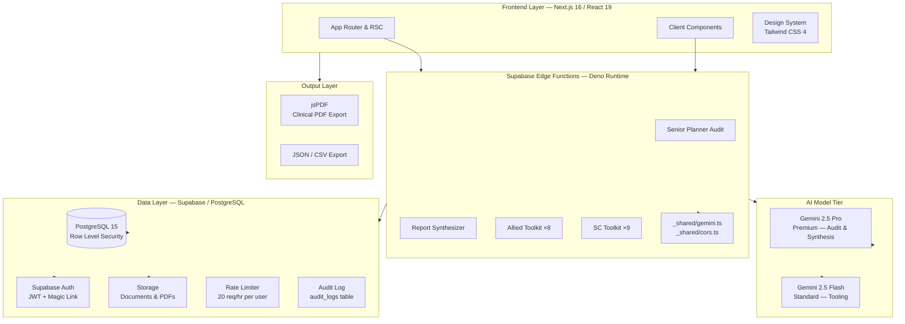
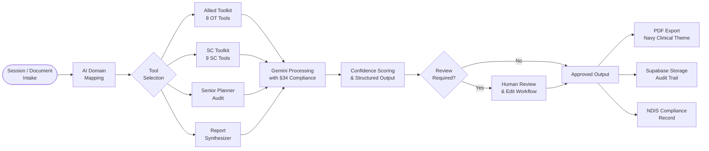

# Praxis AI — Clinical Workflow Management Platform

<div align="center">


[](https://nextjs.org)
[](https://react.dev)
[](https://typescriptlang.org)
[](https://supabase.com)
[](https://deepmind.google/technologies/gemini/)
[](./SECURITY.md)

**Designed and developed by [JD Digital Systems](https://jddigitalsystems.com)**

*AI-powered clinical workflow management for NDIS Occupational Therapists and healthcare professionals*

</div>

---

## Overview

**Praxis AI** is a production-grade, AI-powered clinical workflow management platform purpose-built for Occupational Therapists and NDIS Support Coordinators across Australia. It brings together participant management, regulatory compliance, and advanced AI tooling into a single, cohesive clinical workspace.

The platform runs 17+ Supabase Edge Functions backed by Google Gemini 2.5 Pro and 2.5 Flash, delivering real-time AI assistance, structured audit outputs, professional PDF exports, and a complete NDIS compliance layer — all under a polished dark/light clinical UI.

---

## System Architecture



---

## Clinical Workflow



---

## Feature Matrix

### Core Platform

| Feature | Description | Status |
|---|---|---|
| Dashboard Analytics | Real-time KPIs: active participants, billable hours, AI queue, pending approvals | Live |
| Participant Management | Full lifecycle: profiles, NDIS numbers, status tracking, consent management | Live |
| AI-Powered Reports | Automated clinical report generation with confidence scoring and review queue | Live |
| NDIS Plans | Plan tracking with Core / Capacity / Capital budget breakdowns | Live |
| Audit Logging | Every data access and AI invocation logged to `audit_logs` with user context | Live |
| Active Sessions Panel | Real-time presence tracking: Online / Idle / Offline per user | Live |
| Dark Mode | Full light/dark clinical theme with CSS variable system | Live |
| Role-Based Access | Admin / Clinician / Viewer RBAC via Supabase RLS | Live |

### Allied Toolkit — 8 OT Tools

| Tool | Function |
|---|---|
| AT Justification | Assistive technology funding justification with §34 criteria mapping |
| Evidence Matrix | Clinical evidence matrix builder for NDIS submissions |
| FCA Pipeline | Functional Capacity Assessment intake-to-domain-mapping workflow |
| Goal Progress | NDIS goal progress tracking with AI narrative generation |
| Quality Checker | Clinical document quality review and language compliance check |

### SC Toolkit — 9 Support Coordinator Tools

| Tool | Function |
|---|---|
| Senior Planner Audit | Enterprise §34 compliance auditor — 3-pass AI pipeline, structured findings, navy PDF |
| Report Synthesizer | 5-persona NDIS report writer (SC L2, SSC L3, Plan Review, OT, Progress) with drag-and-drop upload |
| CoC Cover Letter | Change of Circumstances cover letter generator with structured JSON output |
| Justification Drafter | LC-AT justification drafting with Section 34 compliance (premium tier) |
| Plan Management Expert | NDIS plan management chatbot with document analysis |
| Budget Forecaster | Core / Capacity / Capital budget tracking and point-in-time snapshots |
| Case Notes | Visual case notes via AI text-to-note and image-to-note (multimodal) |
| Weekly Summary | AI-generated weekly activity summaries for Support Coordinators |
| Roster Analyzer | Roster analysis and support worker scheduling insights |

---

## Technology Stack

### Frontend

| Technology | Version | Purpose |
|---|---|---|
| Next.js | 16.1.6 | React framework — App Router, RSC, Server Actions |
| React | 19.2.3 | UI component runtime |
| TypeScript | 5 | Full-stack type safety |
| Tailwind CSS | 4 | Utility-first styling with custom clinical design system |
| Lucide React | 0.563.0 | Clinical-appropriate icon set |
| Chart.js + react-chartjs-2 | 4.5.1 | Dashboard analytics and data visualisation |
| jsPDF | 4.0.0 | Client-side clinical PDF generation |
| pdf.js (pdfjs-dist) | 4.10.38 | In-browser PDF parsing for document upload |
| mammoth | 1.11.0 | DOCX-to-text extraction for report upload |

### Backend & Infrastructure

| Technology | Purpose |
|---|---|
| Supabase PostgreSQL 15 | Primary database with Row Level Security (RLS) |
| Supabase Edge Functions (Deno) | 17+ serverless functions for all AI and data processing |
| Supabase Auth | JWT authentication, magic link, session management |
| Supabase Storage | Document and PDF file storage |
| Google Gemini 2.5 Pro | Premium AI model — Senior Planner Audit, Report Synthesizer |
| Google Gemini 2.5 Flash | Standard AI model — Allied Toolkit, SC Toolkit tools |

### Security & Compliance

| Layer | Implementation |
|---|---|
| Row Level Security | All tables scoped by `auth.uid()` — zero cross-user data leakage |
| AI Rate Limiting | 20 AI requests/hour per user via `ai_rate_limits` table |
| Prompt Injection Defence | 13-pattern detection in `src/lib/ai-security.ts`, 2000-char input cap |
| Audit Logging | Every AI call and data access → `audit_logs` via `POST /api/audit` |
| Input Validation | Zod schemas on all API boundaries |
| NDIS Compliance | §34(1)(a)–(f) criteria enforced in audit prompts |
| Privacy Act 1988 | Australian Privacy Principles compliant data handling |

---

## Project Structure

```
Praxis-AI/
├── src/
│   ├── app/
│   │   ├── (authenticated)/        # Protected application routes
│   │   │   ├── dashboard/          # Analytics & KPI dashboard
│   │   │   ├── participants/       # Participant management
│   │   │   ├── reports/            # Reports & documentation centre
│   │   │   ├── ndis-plans/         # NDIS plan management
│   │   │   ├── toolkit/            # Allied Toolkit (8 OT tools)
│   │   │   ├── sc-toolkit/         # SC Toolkit (9 SC tools)
│   │   │   ├── audits/             # Senior Planner Audit + presence panel
│   │   │   ├── ai/                 # AI assistant interface
│   │   │   └── settings/           # Organisation & user settings
│   │   ├── api/                    # Next.js API routes
│   │   ├── auth/                   # Auth callback handlers
│   │   ├── login/                  # Authentication pages
│   │   └── signup/
│   ├── components/                 # Reusable UI components
│   ├── lib/                        # Utilities, AI security, PDF helpers
│   └── types/                      # Shared TypeScript interfaces
├── supabase/
│   ├── functions/                  # 17+ Deno Edge Functions
│   │   ├── _shared/                # Shared gemini.ts + cors.ts helpers
│   │   ├── senior-planner-audit/   # §34 compliance auditor
│   │   ├── synthesize-report/      # 5-persona report synthesizer
│   │   ├── coc-eligibility-assessor/
│   │   ├── fca-pipeline/
│   │   └── ...                     # 13 additional Edge Functions
│   └── migrations/                 # 11+ SQL migration files
├── docs/                           # Comprehensive technical documentation
├── CHANGELOG.md
├── CONTRIBUTING.md
└── SECURITY.md
```

---

## Getting Started

### Prerequisites

- **Node.js** 20.x or higher
- **npm** or **pnpm**
- **Supabase CLI** (`npm install -g supabase`)
- **Supabase Account** — for database and Edge Functions
- **Google Gemini API Key** — for all AI features

### Installation

**1. Clone the repository**
```bash
git clone <repository-url>
cd Praxis-AI
```

**2. Install dependencies**
```bash
npm install
```

**3. Configure environment variables**
```bash
cp .env.example .env.local
```

Set the following in `.env.local`:
```env
NEXT_PUBLIC_SUPABASE_URL=https://your-project.supabase.co
NEXT_PUBLIC_SUPABASE_ANON_KEY=your-anon-key
SUPABASE_SERVICE_ROLE_KEY=your-service-role-key   # server-side only
```

Set `GEMINI_API_KEY` as an Edge Function secret in the Supabase dashboard.

**4. Link Supabase project and run migrations**
```bash
supabase link --project-ref your-project-ref
supabase db push
```

**5. Deploy Edge Functions**
```bash
supabase functions deploy
```

**6. Start development server**
```bash
npm run dev
```

Open [http://localhost:3000](http://localhost:3000) to access the platform.

### Production Build

```bash
npm run build
npm start
```

---

## Documentation

| Document | Description |
|---|---|
| [ARCHITECTURE.md](./docs/ARCHITECTURE.md) | System architecture, data models, scalability strategy |
| [API.md](./docs/API.md) | Complete API reference and Edge Function integration |
| [DEPLOYMENT.md](./docs/DEPLOYMENT.md) | Deployment, environments, CI/CD pipeline |
| [TESTING.md](./docs/TESTING.md) | Testing strategies, coverage requirements, E2E workflows |
| [CONTRIBUTING.md](./CONTRIBUTING.md) | Contribution guidelines, coding standards, PR process |
| [SECURITY.md](./SECURITY.md) | Security policies, vulnerability reporting, compliance |
| [CHANGELOG.md](./CHANGELOG.md) | Full version history and release notes |

---

## Database Schema

The platform uses 11+ SQL migrations defining the following core tables:

```
auth.users (Supabase managed)
    └── profiles                  ← Extended user profile, RBAC role
         ├── participants          ← NDIS participant records
         │    ├── ndis_plans       ← Plan budgets and goals
         │    ├── report_audits    ← §34 audit outputs
         │    └── coc_assessments  ← Change of Circumstances records
         ├── synthesized_reports   ← Report Synthesizer outputs (all 5 personas)
         ├── coc_cover_letter_history
         ├── budgets + budget_snapshots
         ├── plan_management_queries
         ├── case_notes_history
         ├── activity_logs
         ├── ai_rate_limits        ← 20 req/hr sliding window
         └── audit_logs            ← Immutable access + AI invocation log
```

All tables are protected by Row Level Security policies scoped to `auth.uid()`.

---

## Roadmap

### Current — Live
- [x] Full participant and NDIS plan management
- [x] AI-powered report generation with human review workflow
- [x] 17+ Supabase Edge Functions deployed to production
- [x] Allied Toolkit — 8 AI-powered OT tools
- [x] SC Toolkit — 9 AI-powered Support Coordinator tools
- [x] Senior Planner Audit — enterprise §34 compliance auditor with navy PDF
- [x] Report Synthesizer — 5-persona professional NDIS report writer
- [x] Audit logging and presence tracking
- [x] Gemini 2.5 Pro/Flash tiered AI pipeline

### Upcoming
- [ ] Mobile applications (iOS / Android)
- [ ] Voice-to-text clinical notes
- [ ] Predictive participant analytics
- [ ] Multi-tenancy organisation management
- [ ] Integration marketplace (My Aged Care, PRODA)

---

## Compliance

Praxis AI is designed to meet the following regulatory requirements:

- **NDIS Quality and Safeguards Commission** — Practice Standards and §34 criteria
- **Privacy Act 1988** — Australian Privacy Principles (APPs)
- **Healthcare Data Security** — Encryption at rest (AES-256) and in transit (TLS 1.3)
- **ISO 27001** — Information Security Management framework alignment
- **OWASP Top 10** — Mitigated across all application layers

---

## Support

**Developed and maintained by**: [JD Digital Systems](https://jddigitalsystems.com)

| Channel | Contact |
|---|---|
| Technical Support | support@jddigitalsystems.com |
| Security Issues | security@jddigitalsystems.com |
| Product Enquiries | product@jddigitalsystems.com |
| Website | [https://jddigitalsystems.com](https://jddigitalsystems.com) |

For security vulnerabilities, please follow the responsible disclosure process outlined in [SECURITY.md](./SECURITY.md). Do not create public GitHub issues for security reports.

---

## License

Copyright &copy; 2024–2026 JD Digital Systems. All rights reserved.

This software is proprietary and confidential. Unauthorised copying, distribution, or use of this software, via any medium, is strictly prohibited without prior written permission from JD Digital Systems.

---

<div align="center">

**JD Digital Systems — Transforming Healthcare Through Technology**

[Website](https://jddigitalsystems.com) &nbsp;|&nbsp; [Support](mailto:support@jddigitalsystems.com) &nbsp;|&nbsp; [Security](mailto:security@jddigitalsystems.com)

</div>
